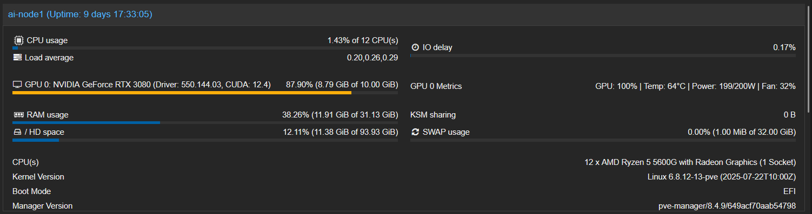
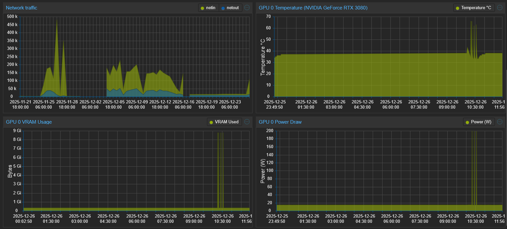

# PVE GPU Dashboard Mod

Native NVIDIA GPU monitoring integration for Proxmox VE web interface.

## Overview

This project adds native-looking GPU monitoring capabilities to the Proxmox VE dashboard. Unlike other solutions that rely on third-party tools or external monitoring systems, this mod integrates directly into the PVE web interface, providing a seamless experience that matches the existing CPU, RAM, and Network monitoring style.

**What gets modified:**
- `/usr/share/perl5/PVE/API2/Nodes.pm` - Adds GPU data collection to the node status API
- `/usr/share/pve-manager/js/pvemanagerlib.js` - Adds GPU widgets to the dashboard UI

The mod was inspired by existing community projects but was rewritten to achieve a more polished, native integration that blends with the Proxmox interface rather than appearing as an add-on or patch.

## Screenshots

### Dashboard Status Section
<!-- Add your screenshot here showing GPU metrics in the Status section -->


### Historical Graphs (v3.0 only)
<!-- Add your screenshot here showing the historical GPU graphs -->


## Tested Configurations

| PVE Version | GPU | Driver | Status |
|-------------|-----|--------|--------|
| 8.4.x | NVIDIA GeForce RTX 3080 | 550.144.03 | Working |
| 9.1.2 | NVIDIA GeForce RTX 5090 | 580.82.09 | Working |

---

## Prerequisites

Before installing this mod, ensure you have the following:

- **Proxmox VE 8.x or 9.x** - Both major versions are supported
- **NVIDIA GPU(s)** - AMD/Intel GPUs are not supported at this time
- **NVIDIA drivers installed** - The `nvidia-smi` command must be available
- **LXC passthrough configured** - This mod is designed for LXC container GPU passthrough, not VM passthrough

> **Note:** If you need help setting up NVIDIA GPU passthrough for LXC containers, refer to this guide:
> https://github.com/en4ble1337/GPU-Passthrough-for-Proxmox-LXC-Container

---

## Important Notices

> [!WARNING]
> **Use at your own risk.** This mod modifies core Proxmox VE files. While backups are created automatically during installation, you should understand the implications of running third-party scripts on your system.

> [!CAUTION]
> **Test in a non-production environment first.** Always verify the mod works correctly in a staging or test environment before deploying to production systems.

> [!IMPORTANT]
> **Read the code before running.** By downloading and using this repository, you acknowledge that you have reviewed the scripts and understand what they do. The authors take no responsibility for any issues, data loss, or system instability that may occur.

> [!NOTE]
> **Backups are created automatically.** The installation script creates timestamped backups of all modified files in `/root/PVE-GPU-DASHBOARD/`. Use the `uninstall` command to restore from these backups.

---

## Installation Options

Two versions are provided to suit different needs:

### Option 1: v1.7 - Dashboard Only (Simple)

Best for users who want basic GPU monitoring without the complexity of historical data collection.

**Features:**
- GPU VRAM usage with progress bar
- Real-time GPU metrics (utilization, temperature, power, fan speed)
- GPU name, driver version, and CUDA version in titles
- Multi-GPU support
- Configurable temperature units (Celsius/Fahrenheit)

**Limitations:**
- No historical graphs
- Current values only

### Option 2: v3.0 - Dashboard + Historical Graphs (Advanced)

Best for users who want comprehensive GPU monitoring with historical trend data.

**Features:**
- Everything in v1.7, plus:
- GPU Temperature historical graph
- GPU VRAM Usage historical graph
- GPU Power Draw historical graph
- Configurable history duration (24 hours, 1 week, or 30 days)
- Native PVE chart styling (matches CPU/Memory/Network graphs)

**Technical Note:** Historical data is stored in browser localStorage rather than the PVE RRD database. This design decision was made because:
- Integrating with PVE's RRD system would require modifying additional core packages
- Browser-side collection works immediately without waiting for database population
- No changes to PVE's database schema are required
- The mod remains simpler and more maintainable

**Limitations:**
- History is browser-specific (not synced across devices)
- Data collection only occurs while the page is open
- Clearing browser storage will delete history

---

## Installation Instructions

### Option 1: Installing v1.7 (Dashboard Only)

1. **Download the script:**
   ```bash
   wget https://raw.githubusercontent.com/en4ble1337/pve-gpu-dashboard/main/pve-gpu-dashboard-mod_v1.7.sh
   chmod +x pve-gpu-dashboard-mod_v1.7.sh
   ```

2. **Run the installer:**
   ```bash
   ./pve-gpu-dashboard-mod_v1.7.sh install
   ```

3. **Follow the prompts:**
   - Select temperature unit (Celsius or Fahrenheit)

4. **Clear your browser cache:**
   - Press `Ctrl+Shift+R` (Windows/Linux) or `Cmd+Shift+R` (Mac)

### Option 2: Installing v3.0 (Dashboard + Historical)

1. **Download the script:**
   ```bash
   wget https://raw.githubusercontent.com/en4ble1337/pve-gpu-dashboard/main/pve-gpu-dashboard-mod_v3.0.sh
   chmod +x pve-gpu-dashboard-mod_v3.0.sh
   ```

2. **Run the installer:**
   ```bash
   ./pve-gpu-dashboard-mod_v3.0.sh install
   ```

3. **Follow the prompts:**
   - Select temperature unit (Celsius or Fahrenheit)
   - Select history duration:
     - **24 hours**: 1-minute intervals, ~144 KB per GPU
     - **1 week**: 1-minute intervals, ~1 MB per GPU
     - **30 days**: 5-minute intervals, ~864 KB per GPU

4. **Clear your browser cache:**
   - Press `Ctrl+Shift+R` (Windows/Linux) or `Cmd+Shift+R` (Mac)

---

## Sample Installation Output (v3.0)

```
root@ai-node1:~# ./pve-gpu-dashboard-mod_v3.0.sh install

=== PVE GPU Dashboard Mod v3.0 Installation ===
[info] Root privileges verified.

=== Detecting NVIDIA GPUs ===
[info] nvidia-smi found.
[info] Detected 1 NVIDIA GPU(s):
  GPU 0, NVIDIA GeForce RTX 3080
[info] Driver Version: 550.144.03
[info] CUDA Version: 12.4

=== Display Settings ===

Display temperatures in Celsius [C] or Fahrenheit [f]? (C/f): C
[info] Using Celsius.

=== Historical Graph Settings ===
Select how much GPU history to store in browser localStorage:

  [1] 24 hours  (1-minute intervals, 1,440 points, ~144 KB per GPU)
      Maximum detail for recent troubleshooting

  [2] 1 week    (1-minute intervals, 10,080 points, ~1 MB per GPU)
      Still detailed for weekly patterns

  [3] 30 days   (5-minute intervals, 8,640 points, ~864 KB per GPU)
      Good balance for long-term trends


Choose history duration [1/2/3]: 2
[info] Using 1 week history (1-minute intervals).

=== Creating backups of modified files ===
[info] Using default backup directory: /root/PVE-GPU-DASHBOARD
[info] Backup directory already exists: /root/PVE-GPU-DASHBOARD
[info] Created backup: /root/PVE-GPU-DASHBOARD/gpu-dashboard.Nodes.pm.20251226_113240
[info] Created backup: /root/PVE-GPU-DASHBOARD/gpu-dashboard.pvemanagerlib.js.20251226_113240

=== Inserting GPU data retrieval code into API ===
[info] GPU data retrieval code added to "/usr/share/perl5/PVE/API2/Nodes.pm".

=== Inserting GPU dashboard items into StatusView ===
[info] GPU dashboard items inserted into StatusView.

=== Inserting GPU historical charts (browser-side collection) ===
[info] GPU historical charts inserted (browser-side data collection with native PVE styling).

=== Finalizing installation ===
[info] Restarting PVE proxy...
[info] Installation completed successfully.

IMPORTANT: Clear your browser cache (Ctrl+Shift+R or Cmd+Shift+R) to see the changes.

Features installed:
  - GPU metrics in Status section (real-time VRAM bar and metrics)
  - GPU historical graphs below Network traffic (Temperature, VRAM, Power)

Historical graph settings:
  - Duration: 1 week
  - Data points: 10080
  - Polling interval: 1 minutes
  - Storage: ~984 KB per GPU in browser localStorage

Note: History persists across page refreshes but is browser-specific.
```

---

## Uninstallation

To remove the mod and restore original files:

```bash
./pve-gpu-dashboard-mod_v3.0.sh uninstall
# or
./pve-gpu-dashboard-mod_v1.7.sh uninstall
```

This will restore the original files from the backups created during installation.

---

## Upgrading

To upgrade from one version to another:

1. Uninstall the current version:
   ```bash
   ./pve-gpu-dashboard-mod_vX.X.sh uninstall
   ```

2. Download and install the new version:
   ```bash
   ./pve-gpu-dashboard-mod_vX.X.sh install
   ```

3. Clear your browser cache.

---

## Troubleshooting

### GPU data shows "N/A" or "No GPU data"
- Verify `nvidia-smi` works from the command line
- Check that NVIDIA drivers are properly installed
- Ensure the GPU is not in a failed state

### Historical graphs not appearing (v3.0)
- Clear browser cache completely (`Ctrl+Shift+R`)
- Check browser console for JavaScript errors
- Verify you're running v3.0 (v2.0 had PVE 9.x compatibility issues)

### Dashboard shows loading spinner
- The mod may have failed to install correctly
- Run `uninstall` and try `install` again
- Check `/var/log/syslog` for PVE proxy errors

### Changes not visible after installation
- Always clear browser cache after installation
- Try a hard refresh: `Ctrl+Shift+R`
- Try opening in a private/incognito window

---

## Technical Details

### Files Modified

| File | Purpose |
|------|---------|
| `/usr/share/perl5/PVE/API2/Nodes.pm` | Backend API - adds GPU metrics to node status endpoint |
| `/usr/share/pve-manager/js/pvemanagerlib.js` | Frontend UI - adds GPU widgets and charts |

### API Fields Added

The mod adds the following fields to the `/nodes/{node}/status` API response:

```json
{
  "gpuDriverVersion": "550.144.03",
  "gpuCudaVersion": "12.4",
  "gpuCount": 1,
  "gpu0_name": "NVIDIA GeForce RTX 3080",
  "gpu0_temp": 45,
  "gpu0_util": 0,
  "gpu0_mem_used": 339738624,
  "gpu0_mem_total": 10737418240,
  "gpu0_power_draw": 15.5,
  "gpu0_power_limit": 320,
  "gpu0_fan": 30,
  "gpu0_metrics": "45,0,15.5,320,30",
  "gpu_server_time": 1735234567
}
```

### Backup Location

All backups are stored in `/root/PVE-GPU-DASHBOARD/` with timestamps:
- `gpu-dashboard.Nodes.pm.YYYYMMDD_HHMMSS`
- `gpu-dashboard.pvemanagerlib.js.YYYYMMDD_HHMMSS`

---

## Contributing

Contributions are welcome. Please:

1. Test changes on both PVE 8.x and 9.x if possible
2. Maintain compatibility with existing installations
3. Follow the existing code style
4. Update CHANGELOG.md with your changes

---

## License

This project is provided as-is under the MIT License. See LICENSE file for details.

---

## Credits

This project was inspired by and builds upon the work of:

- **[j4ys0n/PVE-mods](https://github.com/j4ys0n/PVE-mods)** - Original PVE GPU modification concept that served as the foundation for this implementation

Special thanks to the Proxmox community for their continued support and feedback.

---

## Changelog

See [CHANGELOG.md](CHANGELOG.md) for detailed version history.

**Current Version:** v3.0
**Last Updated:** 2025-12-26

